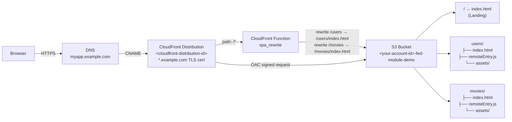
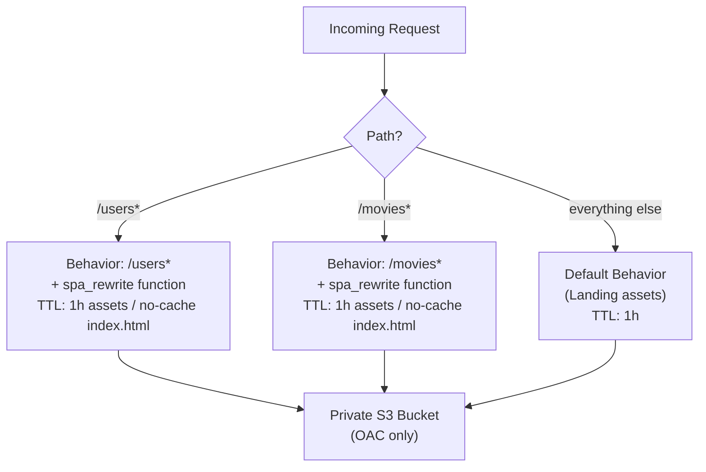
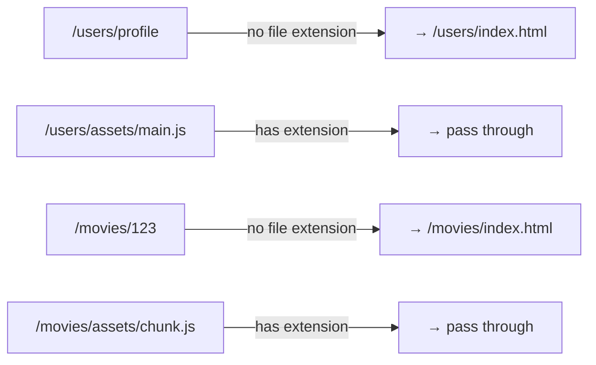
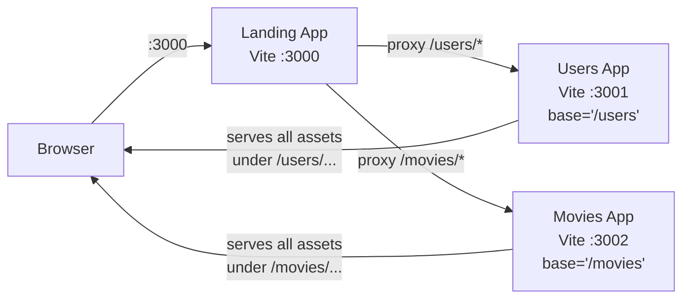
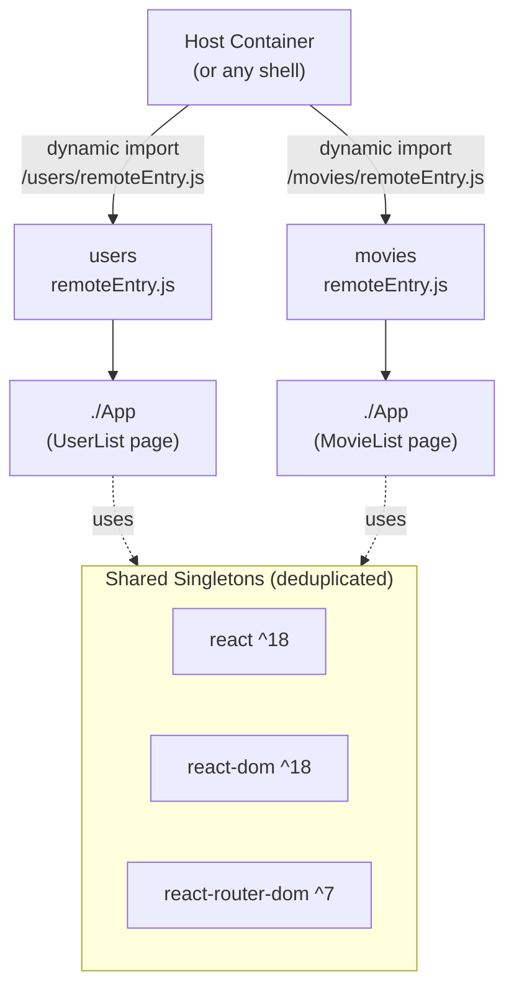
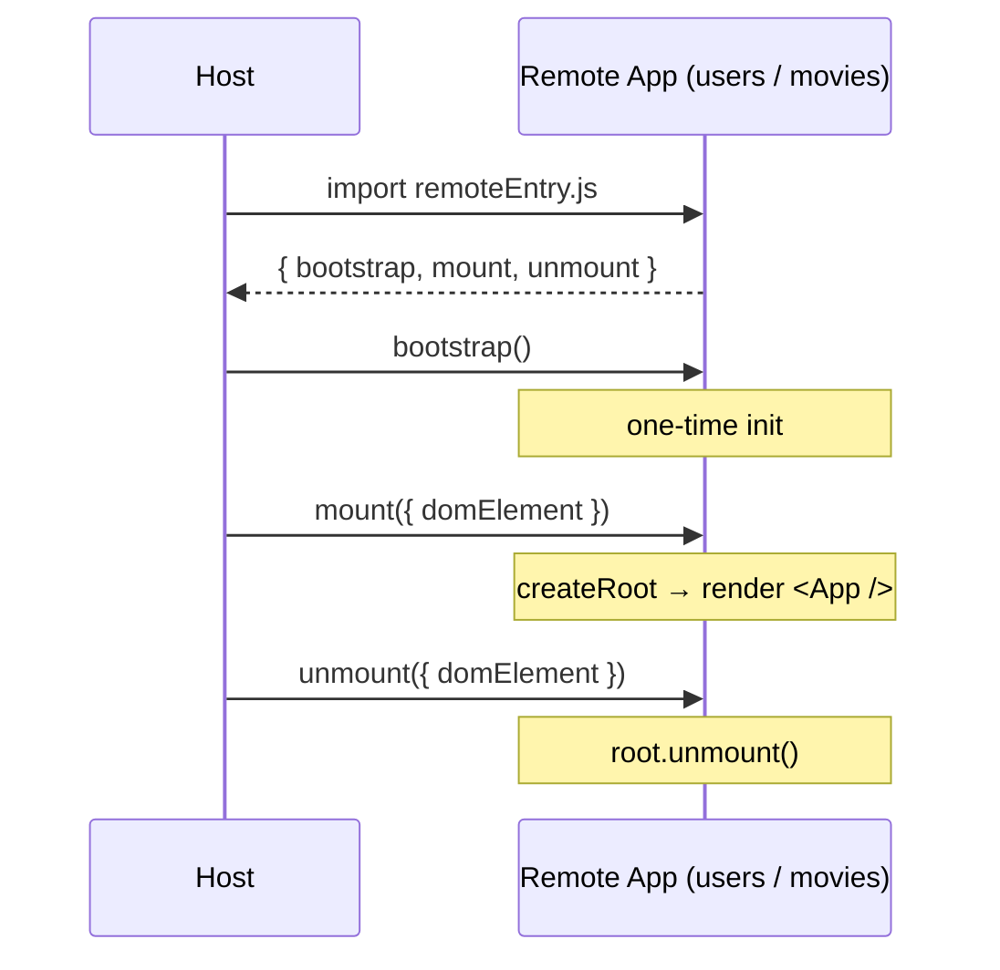
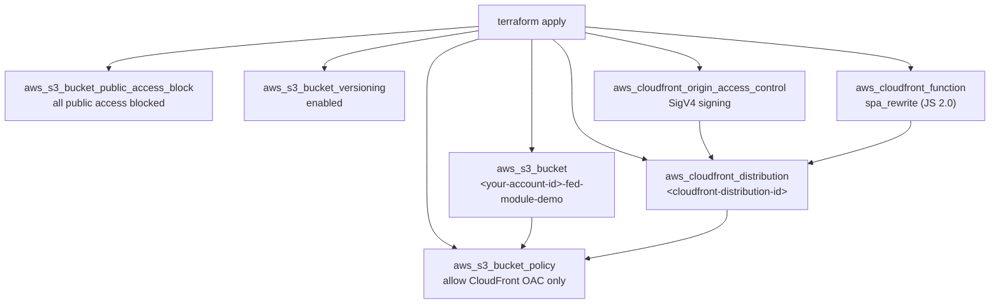
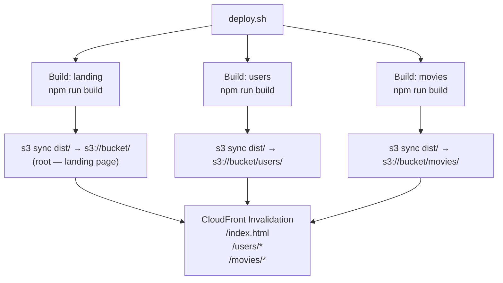
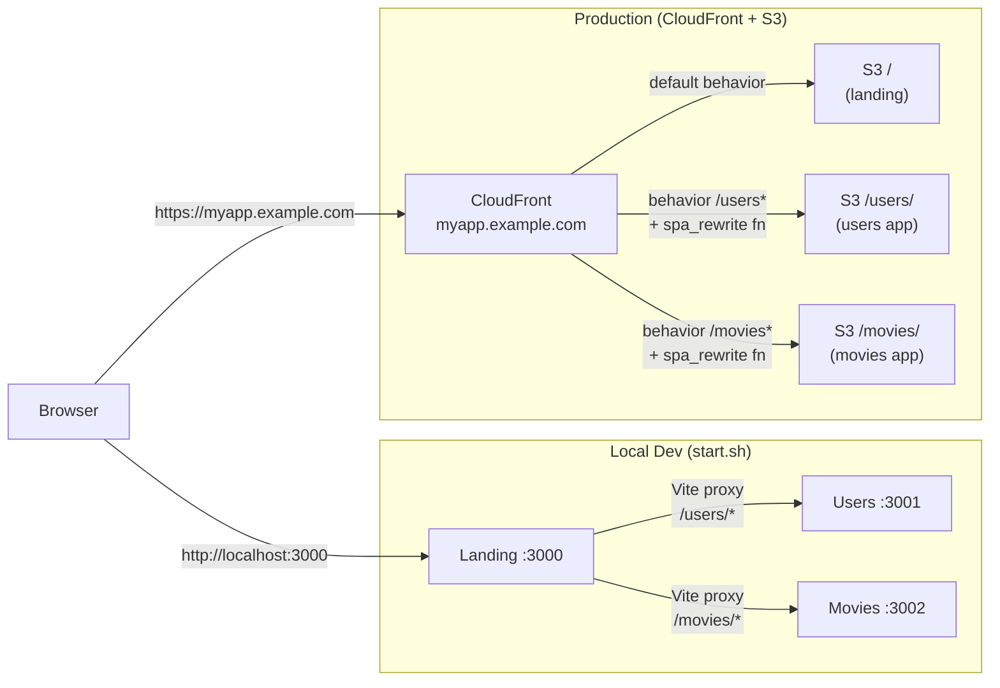

# AWS CDN + S3 — Micro Frontend Platform

Three independently deployable React SPAs served from a single S3 bucket behind CloudFront, composed via **Module Federation** and **single-spa** lifecycles.

| App | Path | Port (dev) |
|---|---|---|
| Landing | `/` | 3000 |
| Users | `/users` | 3001 |
| Movies | `/movies` | 3002 |

---

## Architecture

### Production — CloudFront + S3



### Cache Behaviors



### SPA Deep-Link Rewrite (CloudFront Function)



---

## Local Development

### Dev Server Flow



The landing app's Vite dev server proxies `/users` and `/movies` to their respective dev servers. Because each remote sets `base: '/users'` (or `/movies'`), all asset paths carry the correct prefix — every resource resolves through the proxy without the browser ever knowing a second server is involved.

### Starting All Apps

```bash
./start.sh                        # start landing + users + movies
./start.sh users movies           # start a subset
```

`start.sh` will:
1. Install `node_modules` in any app that's missing them
2. Start all three Vite dev servers in parallel (logs → `.logs/<app>.log`)
3. Poll each port until the server is ready
4. Print all local URLs

```
landing  →  http://localhost:3000/
users    →  http://localhost:3001/users
             (via landing proxy: http://localhost:3000/users)
movies   →  http://localhost:3002/movies
             (via landing proxy: http://localhost:3000/movies)
```

Press **Ctrl+C** to stop all apps.

---

## Module Federation

Each remote app (users, movies) exposes its root component via `@originjs/vite-plugin-federation`:



### `vite.config.ts` — remote app pattern

```typescript
federation({
  name: 'users',           // module scope name
  filename: 'remoteEntry.js',
  exposes: {
    './App': './src/App',  // what the host imports
  },
  shared: {
    react:            { singleton: true, requiredVersion: '^18.0.0' },
    'react-dom':      { singleton: true, requiredVersion: '^18.0.0' },
    'react-router-dom': { singleton: true, requiredVersion: '^7.0.0' },
  },
})
```

`singleton: true` ensures only one copy of React runs in the page even when multiple remotes load.

---

## single-spa Lifecycle

Each remote exports three lifecycle hooks consumed by the host container:



### `main.tsx` — lifecycle export pattern

```typescript
const lifecycles = singleSpaReact({
  React,
  ReactDOM: { createRoot } as any,  // React 18 compat
  rootComponent: App,
  renderType: 'createRoot',
})

export const { bootstrap, mount, unmount } = lifecycles
```

Standalone dev guard (runs when NOT inside single-spa):

```typescript
if (!(window as any).__POWERED_BY_SINGLE_SPA__) {
  createRoot(document.getElementById('root')!).render(<App />)
}
```

---

## React Router v7 — Path Isolation

Each app creates its router with a `basename` matching its S3 prefix so React Router only handles the sub-path, not the full URL:

```typescript
// users/src/App.tsx
const router = createBrowserRouter(
  [{ path: '/', element: <UserList /> }],
  { basename: '/users' }   // ← React Router sees "/" when browser is at "/users"
)
```

---

## Registry Files

### `remote-apps-registry.yaml`

Consumed by the host container at startup to dynamically register Module Federation remotes and their routes:

```yaml
remotes:
  users:
    name: users
    scope: users
    url: https://${CLOUDFRONT_DOMAIN}/users/remoteEntry.js
    component: ./App
    port: 3001                  # used in local override mode
    routes:
      - path: /users
        layout: main
      - path: /users/*
        layout: main

  movies:
    name: movies
    scope: movies
    url: https://${CLOUDFRONT_DOMAIN}/movies/remoteEntry.js
    component: ./App
    port: 3002
    routes:
      - path: /movies
        layout: main
      - path: /movies/*
        layout: main
```

### `layout-apps-registry.yaml`

Maps layout type names (used in routes above) to their implementation paths:

```yaml
layouts:
  main:
    name: main-layout
    description: Standard layout with header and navigation
    lifecycle: src/apps/layout-app/layouts/main-layout/lifecycles/index.ts

  empty:
    name: empty-layout
    description: Bare layout with no chrome (for auth/error pages)
    lifecycle: src/apps/layout-app/layouts/empty-layout/lifecycles/index.ts
```

---

## Infrastructure (Terraform)

### Resources provisioned



### Variables

| Variable | Default | Description |
|---|---|---|
| `aws_region` | `us-east-1` | AWS region for all resources |
| `bucket_name` | *(required)* | S3 bucket name — use your account ID as a prefix for global uniqueness |
| `alternate_domain` | *(required)* | CloudFront custom domain (e.g. `myapp.example.com`) |
| `acm_certificate_arn` | *(required)* | ACM cert ARN — **must be in us-east-1** |
| `environment` | `production` | Tag value applied to all resources |

Copy the example file and fill in your values:

```bash
cp terraform/terraform.tfvars.example terraform/terraform.tfvars
```

`terraform/terraform.tfvars`:

```hcl
bucket_name         = "123456789012-fed-module-demo"
alternate_domain    = "myapp.example.com"
acm_certificate_arn = "arn:aws:acm:us-east-1:123456789012:certificate/<your-cert-uuid>"
```

Get your certificate ARN with:
```bash
aws acm list-certificates --region us-east-1 --query 'CertificateSummaryList[].{Domain:DomainName,ARN:CertificateArn}'
```

### Outputs

```
bucket_name                = "&lt;your-account-id&gt;-fed-module-demo"
cloudfront_domain          = "&lt;cf-domain&gt;.cloudfront.net"
cloudfront_distribution_id = "&lt;cloudfront-distribution-id&gt;"
dns_instruction            = "CNAME myapp.example.com → &lt;cf-domain&gt;.cloudfront.net"
landing_url                = "https://myapp.example.com/"
users_url                  = "https://myapp.example.com/users"
movies_url                 = "https://myapp.example.com/movies"
```

### Provisioning

```bash
cd terraform

# First time
terraform init

# Preview changes
terraform plan

# Apply
terraform apply
```

> ACM certificate must be issued in `us-east-1` regardless of your app region — CloudFront is a global service and only reads from that region's ACM.

---

## Deployment

### Full deploy (all apps)

```bash
# Get outputs from Terraform
BUCKET_NAME=$(cd terraform && terraform output -raw bucket_name)
DISTRIBUTION_ID=$(cd terraform && terraform output -raw cloudfront_distribution_id)

BUCKET_NAME=$BUCKET_NAME DISTRIBUTION_ID=$DISTRIBUTION_ID ./scripts/deploy.sh
```

### Deploy a single app

```bash
BUCKET_NAME=$BUCKET_NAME DISTRIBUTION_ID=$DISTRIBUTION_ID APPS=users ./scripts/deploy.sh
```

### Deploy flow



### Cache strategy per file type

| File | Cache-Control | Reason |
|---|---|---|
| `index.html` | `no-cache, no-store` | Always fetch latest shell |
| `remoteEntry.js` | `max-age=60` | Fast host pickup of new versions |
| `assets/*.js` / `assets/*.css` | `max-age=31536000, immutable` | Hashed filenames — safe forever |

---

## DNS Setup

After `terraform apply`, get the CloudFront domain from outputs:

```bash
cd terraform && terraform output cloudfront_domain
# e.g. abcdef123456.cloudfront.net
```

Add this record in your DNS provider:

```
Type:  CNAME
Name:  <your-subdomain>           # the part before your root domain
Value: <cloudfront-domain-output> # from terraform output cloudfront_domain
```

Verify propagation:

```bash
dig +short myapp.example.com @8.8.8.8
# expected: <cf-domain>.cloudfront.net.

curl -I https://myapp.example.com/
# expected: HTTP/2 200
```

---

## Project Structure

### Module Relationships

```mermaid
graph TD
    root["repo root"]

    root --> landing["landing/\nLanding page SPA\nport 3000"]
    root --> users["users/\nUsers micro-frontend\nport 3001"]
    root --> movies["movies/\nMovies micro-frontend\nport 3002"]
    root --> terraform["terraform/\nAWS infrastructure"]
    root --> scripts["scripts/\ndeploy.sh"]
    root --> reg1["remote-apps-registry.yaml"]
    root --> reg2["layout-apps-registry.yaml"]
    root --> start["start.sh"]

    landing --> l1["src/main.tsx\nstandalone bootstrap"]
    landing --> l2["src/App.tsx"]
    landing --> l3["src/components/\nLandingPage.tsx"]
    landing --> l4["vite.config.ts\nproxy /users → :3001\nproxy /movies → :3002"]

    users --> u1["src/main.tsx\nsingle-spa lifecycles\nbootstrap · mount · unmount"]
    users --> u2["src/App.tsx\nbasename='/users'"]
    users --> u3["src/components/\nUserList.tsx"]
    users --> u4["vite.config.ts\nModule Federation\nexposes './App'\nbase='/users'"]

    movies --> m1["src/main.tsx\nsingle-spa lifecycles"]
    movies --> m2["src/App.tsx\nbasename='/movies'"]
    movies --> m3["src/components/\nMovieList.tsx"]
    movies --> m4["vite.config.ts\nModule Federation\nexposes './App'\nbase='/movies'"]

    terraform --> t1["main.tf\nAWS provider"]
    terraform --> t2["s3.tf\nS3 bucket + OAC policy"]
    terraform --> t3["cloudfront.tf\nDistribution + Function"]
    terraform --> t4["variables.tf"]
    terraform --> t5["outputs.tf"]

    style landing  fill:#1e3a5f,color:#fff,stroke:#3b82f6
    style users    fill:#1e3a5f,color:#fff,stroke:#6366f1
    style movies   fill:#1e3a5f,color:#fff,stroke:#f59e0b
    style terraform fill:#1a3a2a,color:#fff,stroke:#22c55e
    style scripts  fill:#2a1a3a,color:#fff,stroke:#a78bfa
```



### How the modules connect at runtime



### File tree

```
.
├── landing/                    # Landing page SPA (port 3000)
│   ├── src/
│   │   ├── main.tsx
│   │   ├── App.tsx
│   │   └── components/
│   │       └── LandingPage.tsx
│   ├── vite.config.ts          # Vite dev proxy for /users and /movies
│   └── package.json
│
├── users/                      # Users micro-frontend (port 3001)
│   ├── src/
│   │   ├── main.tsx            # single-spa lifecycles + standalone bootstrap
│   │   ├── App.tsx             # React Router v7, basename=/users
│   │   └── components/
│   │       └── UserList.tsx
│   ├── vite.config.ts          # Module Federation: exposes ./App
│   └── package.json
│
├── movies/                     # Movies micro-frontend (port 3002)
│   ├── src/
│   │   ├── main.tsx
│   │   ├── App.tsx             # basename=/movies
│   │   └── components/
│   │       └── MovieList.tsx
│   ├── vite.config.ts
│   └── package.json
│
├── terraform/                  # AWS infrastructure
│   ├── main.tf                 # Provider (aws ~> 5.0)
│   ├── variables.tf            # Input variables
│   ├── s3.tf                   # Bucket + public access block + OAC policy
│   ├── cloudfront.tf           # Distribution + OAC + CloudFront Function
│   ├── outputs.tf              # URLs, distribution ID, DNS instruction
│   └── terraform.tfvars.example
│
├── scripts/
│   └── deploy.sh               # Build → S3 sync → CloudFront invalidation
│
├── remote-apps-registry.yaml   # Module Federation + route registry
├── layout-apps-registry.yaml   # Layout shell registry
├── start.sh                    # Local dev launcher (all 3 apps)
└── .gitignore
```

---

## Tech Stack

| Layer | Technology |
|---|---|
| UI Framework | React 18 |
| Build Tool | Vite 5 |
| Routing | React Router v7 (`createBrowserRouter`) |
| Module Federation | `@originjs/vite-plugin-federation` |
| Micro-frontend orchestration | single-spa + single-spa-react |
| Language | TypeScript 5 |
| CDN | AWS CloudFront |
| Storage | AWS S3 (private, OAC access) |
| TLS | AWS ACM (`*.example.com` wildcard) |
| Infrastructure as Code | Terraform >= 1.5, AWS provider ~> 5.0 |
