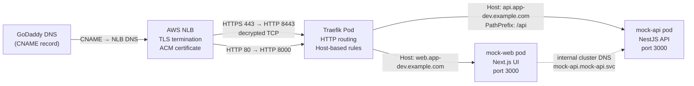
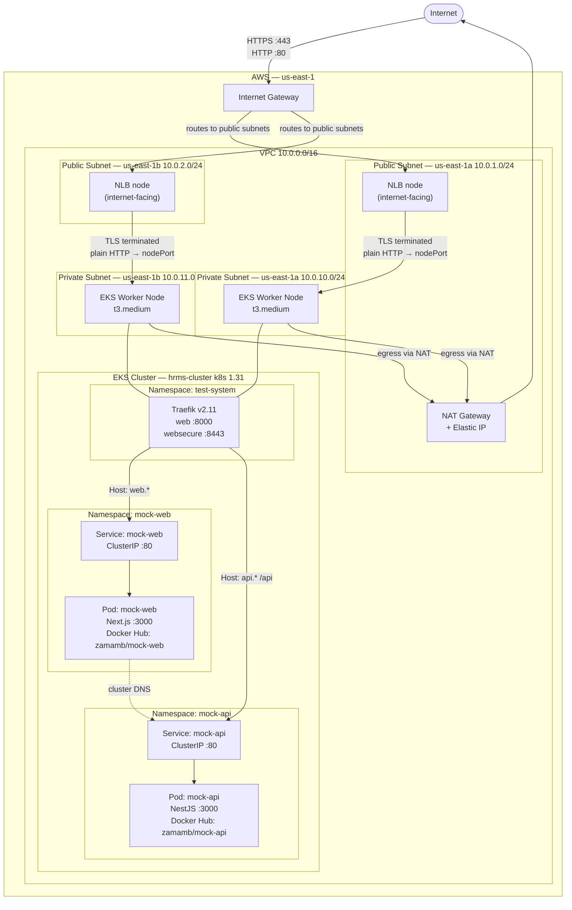

# nlb-traefik-ingress-nestjs

A Next.js e-commerce frontend (`mock-web`) + NestJS API backend (`mock-api`) deployed on AWS EKS, routed through Traefik as an ingress proxy, exposed via an internet-facing NLB with ACM TLS termination.

---

## Architecture

### Simple Flow



---

### Network Flow — VPC & Subnets



---

## Infrastructure Components

| Component | Details |
|---|---|
| **EKS Cluster** | `hrms-cluster`, Kubernetes 1.31, us-east-1 |
| **Node Group** | `hrms-ng-2`, `t3.medium`, desired 1 / max 2, private subnets |
| **NLB** | Internet-facing, cross-zone, ports 80 + 443 |
| **TLS** | ACM certificate, terminated at NLB on port 443 |
| **Traefik** | Helm chart v26.1.0, namespace `test-system`, CRD IngressRoutes |
| **mock-web** | `zamamb/mock-web:latest`, namespace `mock-web` |
| **mock-api** | `zamamb/mock-api:latest`, namespace `mock-api` |

---

## Prerequisites

### Local development
- [Node.js](https://nodejs.org/) >= 22.0.0
- [pnpm](https://pnpm.io/) >= 9.0.0
- [Docker](https://www.docker.com/)

### Infrastructure
- AWS CLI configured
- Terraform >= 1.5.0
- `kubectl`
- Docker Hub account

---

## Running Locally

```bash
pnpm install
pnpm dev
```

App available at [http://localhost:3000/web](http://localhost:3000/web).

| Command | Description |
|---|---|
| `pnpm build` | Build for production |
| `pnpm start` | Start the production server |
| `pnpm lint` | Run ESLint |
| `pnpm test` | Run tests |
| `pnpm test:coverage` | Run tests with coverage |

---

## Running with Docker

```bash
# Build (linux/amd64 required for EKS t3.medium nodes on Apple Silicon)
docker buildx build --platform linux/amd64 -t mock-web .

# Run
docker run -p 3000:3000 mock-web
```

---

## Deploying to Docker Hub

```bash
export DOCKERHUB_USERNAME=your-username
export IMAGE_NAME=mock-web    # optional, default: mock-web
export IMAGE_TAG=v1.0.0       # optional, default: latest

./deploy.sh
```

Builds `linux/amd64` via `docker buildx` and pushes `:<tag>` + `:latest` to Docker Hub.

---

## Deploying to AWS EKS

### 1. Provision infrastructure

```bash
cd terraform
./create.sh
```

Three-stage apply:
1. EKS cluster, VPC, subnets, NAT gateway, IAM
2. Traefik Helm chart + internet-facing NLB
3. App deployments, services, IngressRoutes

### 2. Build and push application image

```bash
./deploy-k8s.sh --ui --username your-dockerhub-username
```

### 3. Configure kubectl

```bash
aws eks update-kubeconfig --region us-east-1 --name hrms-cluster
```

### 4. Configure GoDaddy DNS

After `terraform apply`, run:

```bash
cd terraform && terraform output godaddy_cname_instructions
```

Add the printed CNAME records in GoDaddy DNS Manager:

```
web.app-dev.example.com   CNAME  <nlb-dns>.elb.us-east-1.amazonaws.com
api.app-dev.example.com   CNAME  <nlb-dns>.elb.us-east-1.amazonaws.com
```

Allow up to 10 minutes for DNS propagation. TLS is handled by the ACM certificate — no additional cert setup required.

---

## Teardown

```bash
cd terraform
./cleanup.sh
```

---

## Project Structure

```
.
├── src/
│   ├── app/              # Next.js App Router pages
│   │   ├── page.tsx      # Homepage (ShopNow landing)
│   │   ├── products/     # Products listing (fetches from mock-api)
│   │   └── cart/         # Shopping cart
│   ├── data/             # Static product data
│   └── types/            # TypeScript interfaces
├── terraform/
│   ├── vpc.tf            # VPC, subnets, IGW, NAT, route tables
│   ├── security_groups.tf # EKS cluster + node SGs
│   ├── eks.tf            # EKS cluster, node group, OIDC, IAM
│   ├── traefik.tf        # Traefik Helm release + NLB data sources
│   ├── app.tf            # mock-api deployment, service, IngressRoute
│   ├── ui.tf             # mock-web deployment, service, IngressRoute
│   ├── outputs.tf        # NLB DNS, GoDaddy CNAME instructions
│   ├── variables.tf      # All input variables
│   ├── terraform.tfvars  # Active variable values
│   ├── create.sh         # Three-stage provision script
│   ├── cleanup.sh        # Two-stage teardown script
│   └── import.sh         # State reconciliation via terraformer
├── Dockerfile            # Multi-stage build (node:22-alpine)
├── deploy.sh             # Build + push to Docker Hub
└── deploy-k8s.sh         # Full EKS rollout orchestrator
```

---

## Tech Stack

| Layer | Technology |
|---|---|
| **Frontend** | Next.js 16, TypeScript, Tailwind CSS 4 |
| **Backend** | NestJS (Docker Hub: `zamamb/mock-api`) |
| **Container** | Docker, `node:22-alpine`, standalone output |
| **Registry** | Docker Hub |
| **Orchestration** | AWS EKS, Kubernetes 1.31 |
| **Ingress** | Traefik v2.11, CRD IngressRoutes |
| **Load Balancer** | AWS NLB (internet-facing, cross-zone) |
| **TLS** | AWS ACM certificate (NLB termination) |
| **DNS** | GoDaddy CNAME → NLB |
| **IaC** | Terraform >= 1.5.0 |
| **Testing** | Vitest, Testing Library, msw |
