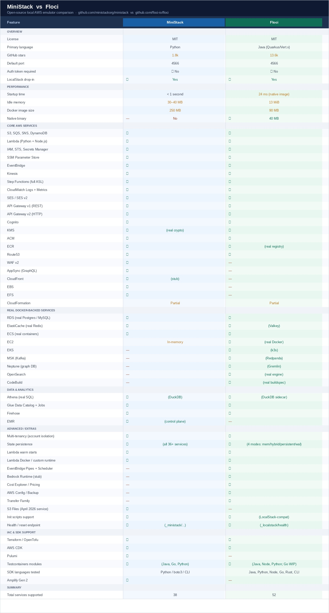

# AWS Local Emulators

Local AWS development environments using emulators — no AWS account or real credentials needed.



## Projects

| Project | Description |
|---------|-------------|
| [floci](https://github.com/mbzama/aws-training/tree/main/emulators/floci) | Event ticket booking platform using Floci (LocalStack) |
| [ministack/healthcare-demo](https://github.com/mbzama/aws-training/tree/main/emulators/ministack/healthcare-demo) | Healthcare demo using Ministack with API Gateway, Kinesis, SNS/SQS, S3 |

---

## [floci](https://github.com/mbzama/aws-training/tree/main/emulators/floci)

A full event ticketing system with a Flask API, async worker, and React frontend. Runs entirely on localhost using Floci to emulate DynamoDB, S3, SQS, SNS, and Cognito.

**Key files:**
- [`app.py`](https://github.com/mbzama/aws-training/blob/main/emulators/floci/app.py) — Flask REST API
- [`worker.py`](https://github.com/mbzama/aws-training/blob/main/emulators/floci/worker.py) — Async SQS consumer / PDF ticket generator
- [`docker-compose.yml`](https://github.com/mbzama/aws-training/blob/main/emulators/floci/docker-compose.yml) — Floci container setup
- [`terraform/`](https://github.com/mbzama/aws-training/tree/main/emulators/floci/terraform) — IaC for DynamoDB, SQS, SNS, S3, Cognito
- [`frontend/`](https://github.com/mbzama/aws-training/tree/main/emulators/floci/frontend) — React app (port 3000)

**Quick start:**
```bash
podman-compose up -d
cd terraform && terraform init && terraform apply -auto-approve && cd ..
python seed_events.py
python app.py        # Terminal 2
python worker.py     # Terminal 3
cd frontend && npm start  # Terminal 4
```

See [`floci/README.md`](https://github.com/mbzama/aws-training/blob/main/emulators/floci/README.md) for full documentation.

---

## [ministack/healthcare-demo](https://github.com/mbzama/aws-training/tree/main/emulators/ministack/healthcare-demo)

A healthcare data streaming demo showcasing AWS services via Ministack. Demonstrates Kinesis producers/consumers, API Gateway routing, SNS/SQS messaging, and S3 storage — all local.

**Key files:**
- [`startup.sh`](https://github.com/mbzama/aws-training/blob/main/emulators/ministack/healthcare-demo/startup.sh) — Bootstrap all local services
- [`producer.js`](https://github.com/mbzama/aws-training/blob/main/emulators/ministack/healthcare-demo/producer.js) — Kinesis data producer
- [`consumer.js`](https://github.com/mbzama/aws-training/blob/main/emulators/ministack/healthcare-demo/consumer.js) — Kinesis data consumer
- [`dashboard.html`](https://github.com/mbzama/aws-training/blob/main/emulators/ministack/healthcare-demo/dashboard.html) — Local monitoring UI
- [`apigw.sh`](https://github.com/mbzama/aws-training/blob/main/emulators/ministack/healthcare-demo/apigw.sh) — API Gateway setup scripts

**Quick start:**
```bash
cd ministack/healthcare-demo
bash startup.sh
node producer.js
node consumer.js
```

---

## Ministack vs Floci

Both tools emulate AWS services locally. The diagram above shows their architectural differences.

| Feature | Ministack | Floci (LocalStack) |
|---------|-----------|-------------------|
| **Focus** | Lightweight core services | Broad AWS service coverage |
| **Services** | Kinesis, SQS, SNS, S3, API GW | DynamoDB, S3, SQS, SNS, Cognito, and more |
| **Config** | Shell scripts | Docker Compose + Terraform |
| **Best for** | Streaming / event-driven demos | Full-stack app development |
